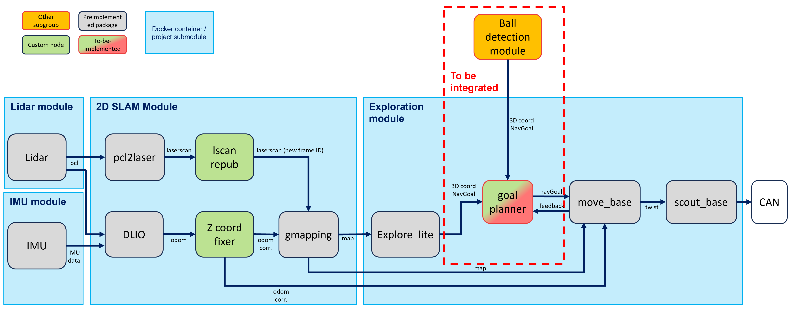

# Ball Picking Project

This repository acts as the main repository to be deployed on the Agile-X Scout2.0 robot for the AUS/IFRoS lab 2023 project of searching for and picking up tennis balls.
<br><br>
**Created by:** <br>
Kevin Schmidt: cbsx3q@inf.elte.hu

## Project team & responsibilities

| Name                | Responsibilities                       |
| ------------------- | -------------------------------------- |
| Amine Dhemaied      | Robotic arm kinematics & ball grabbing |
| Zeljko Jovanovic    | Robotic arm kinematics & ball grabbing |
| Moshin Kabir        | Ball detection & localization          |
| Kevin Schmidt       | Mobile base SLAM & navigation          |
| Sivadinesh Ponjaran | Emotional support engineer             |

<p align="center">
    
</p>

## Architecture

### Project architecture

The project architecture, including the containerization approach, is described in detail on [this page](https://github.com/IFRoS-ELTE/ball_picking_project/blob/main/docs/docker.md).

### Arm actuation

TODO

### Ball detection

TODO

### Mobile base

To create inputs for GMapping (2D SLAM), the robot's odometry gets calculated using [Direct Lidar Inertial Odometry](https://github.com/vectr-ucla/direct_lidar_inertial_odometry), which uses LiDAR and IMU data. There is unwanted drift in z-direction of the odometry because of unknown reasons, so it needs to be set to a static value to be usable. Since GMapping is a 2D SLAM algorithm, the LiDAR point cloud gets downsampled to a 2D laser scan. Based on the created 2D map, the mobile base can either autonomously explore the area using frontier exploration or approach a 3D world coordinate given to it by the ball detection module. For controlling the robot, move_base receives navGoals and sends twist messages to the scout_base, which is responsible for communicating with the physical robot through CAN.

#### Architecure diagram of the mobile base part of the project



#### Visualization of autonomous exploration


## Setup

### 1. Clone this repository recursively on the Scout2.0

```bash
git clone --recurse-submodules https://github.com/IFRoS-ELTE/ball_picking_project.git
```

### 2. Go into the repository

```bash
cd ./ball_picking_project
```

### 3. Execute necessary startup scripts

This repository includes 2 scripts which are needed to run the project. Please execute both before proceeding. This assumes you deploy the project on the Silvanus robot and the necessary code to establish a CAN connection are present

#### 3.1 display.sh

Necessary to allow the Docker containers to display GUI applications, namely RViz

```bash
./display.sh
```

#### 3.2 can_setup.bash

Sets up the CAN interface to communicate with the mobile base

```bash
./can_setup.bash
```

### 2. Build and launch the containers

Now, you can build and/or start the project:

```bash
sudo docker compose up
```

When you freshly cloned the project, the containers will get built and created first. In this case, the catkin workspaces inside the containers also will build automatically. If it is not the first time you start up the containers, they should launch immediately and RViz should be displayed.

### Stopping and re-launching

To stop and close the nodes, simply use `CTRL+C`, this will stop all containers. You can use `sudo docker compose up` if you want to re-launch. If you, for some reason, want to remove the containers, you can do so with the `sudo docker compose down` command. This means that at the next startup using `sudo docker compose up`, the containers will be newly created and all the ros workspaces inside will have to be freshly built as well.

## ToDo's

Unfortunately, the project is not completely finished. There are multiple things that need to be done before the objective of exploring an unknown area and picking up tennis balls can be achieved. Therefore, we provide a list of ToDo's that can be implemented by future students to make the entire project operational.

| ToDo                                                   | Submodule             | Description                                                                                                                                                                                                                                                                                                                                                                                                                                                                                             | Severity                                                                                            |
| ------------------------------------------------------ | --------------------- | ------------------------------------------------------------------------------------------------------------------------------------------------------------------------------------------------------------------------------------------------------------------------------------------------------------------------------------------------------------------------------------------------------------------------------------------------------------------------------------------------------- | --------------------------------------------------------------------------------------------------- |
| Investigate odom drift                                 | scout2_2d_slam_module | As described ealier, there is a drift in z-direction for the robot odometry. We don't know why. It could be because of noise in the IMU data or some other insufficient calibration.                                                                                                                                                                                                                                                                                                                    | low (does not affect system performance to much)                                                    |
| Investigate odom / mapping mess-up                     | scout2_2d_slam_module | In narrow passages like inside the CLC or outside when the robot wobbles around a lot, the robot sometimes completely looses sense of the correct odometry, making it impossible to continue mapping. This could be related to the previous issue, but could also have other reasons.                                                                                                                                                                                                                   | medium (not a dealbreaker it could break the mapping and therefore pathplanning)                    |
| costmap as frontier exploration input                  | exploration_module    | Currently, explore lite uses the map created by GMapping. According to the documentation of the package, it is also able to use a costmap for that, but for some reason this did not work for us (the lines are still commented in the nav_and_explore.launch). However, a costmap-based exploration would help to avoid that small gaps in the map are considered as frontiers.                                                                                                                        | low (just causes the robot to go to weird places sometimes)                                         |
| Integration with ball detection & arm                  | exploration_module    | In order to approach detected balls we need to be able to actually receive 3D coordinates/navGoals for the balls in order to approach them. The goal planning node could be implemented like this:  The integration most certainly also comes with more necessary adjustments like a continuous communication between ball detection/arm submodule and base to make tiny adjustments in the robot position to be able to grab the ball. | high (integration necessary in order to enable the project objective)                               |
| Proper containerization of arm and ball detection code | TBD -> not yet here!  | The containerization approach has to be applied properly to the code that is responsible for moving the arm and the ball detection. It should be done as described in the [containerization approach description](./docs/docker.md). The already containerized modules for the mobile base can be seen as template repositories                                                                                                                                                                         | high (only by applying the containerization approach it is possible to run the project as intended) |
| Modify IMU repo to support ARM                         | xsens_imu_module      | The dockerfile of the repo installs the MT Software suite (IMU driver) only for x86 systems. To also be deployable on the Pomona robot, it is necessary to find a way to install the suite for ARM as well, as Pomona runs on ARM (NVIDIA Jetson AGX Xavier). More information can be found in the mentioned repository.                                                                                                                                                                                |
| ...                                                    | ...                   | ...                                                                                                                                                                                                                                                                                                                                                                                                                                                                                                     | ...                                                                                                 |
