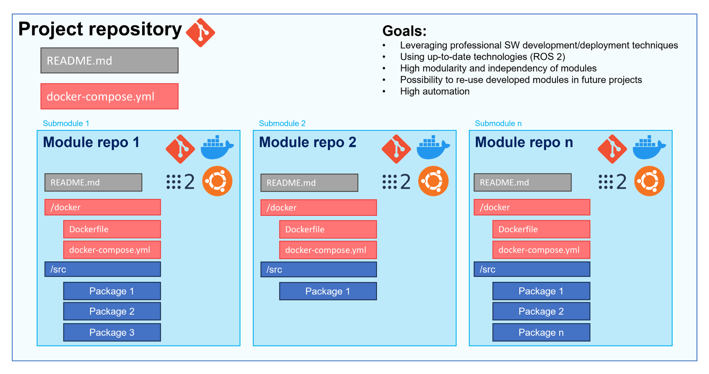
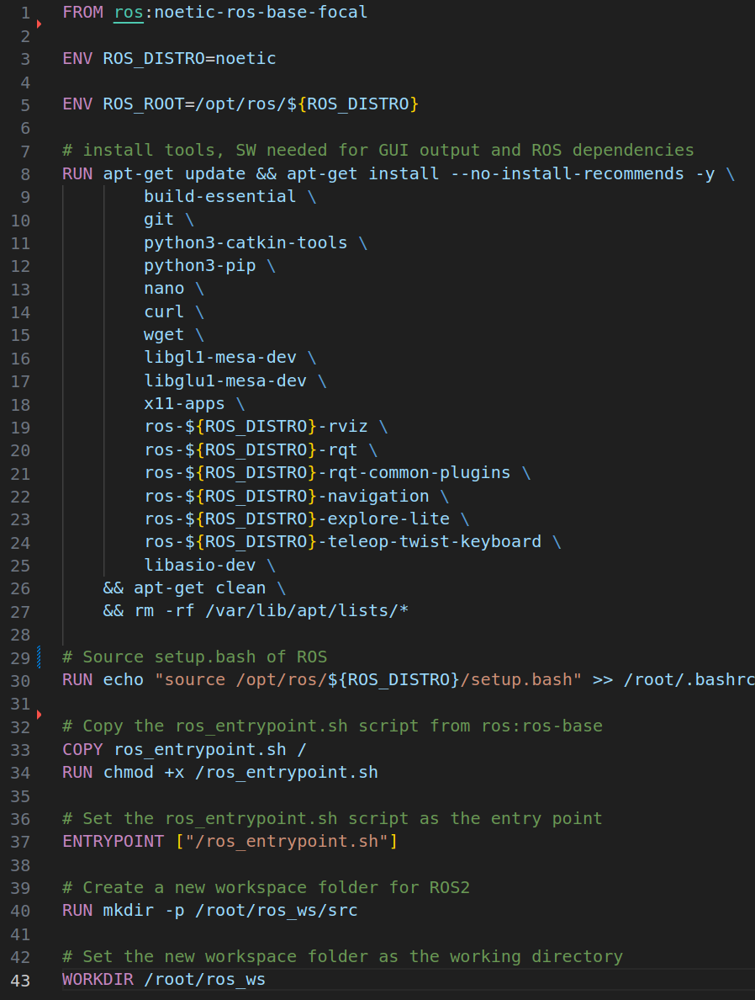
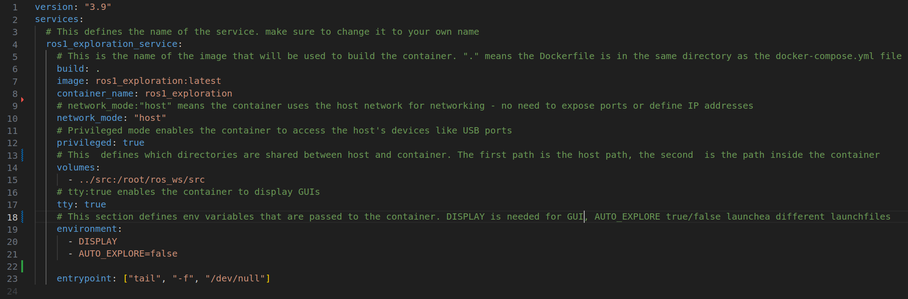
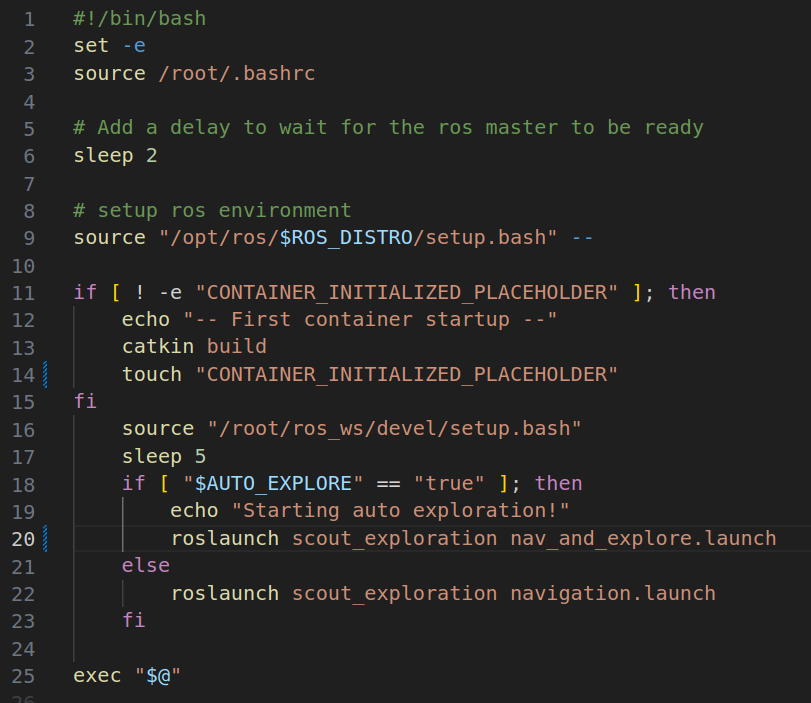
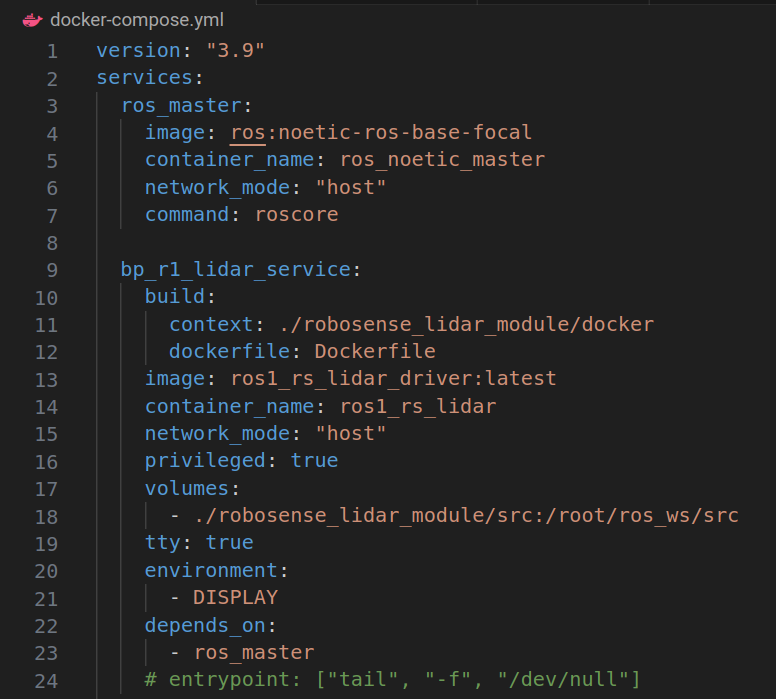
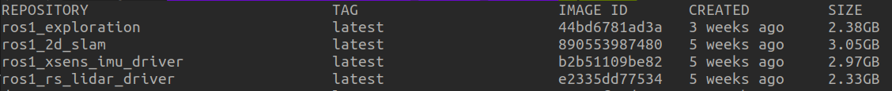
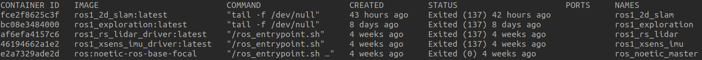

# Containerization approach overview

This repository repository acts as a management framework for the 2023 robot ball-picking project of the IFRoS/AUS lab course at ELTE. To achieve this, it includes multiple submodules for individual tasks that are executable in Docker containers. These containers are then configured by a Docker compose file in the main project repository.

Since Docker was not used in the context of this lab course until now, this file includes some foundational information about:

- Why to use Docker
- Architectural considerations for containerizing robotics projects
- Basic How-To's and commands for Docker
- Limitations of the current approach

For further questions, do not hesitate to contact the creator of this containerized mess: <br>
Kevin Schmidt: cbsx3q@inf.elte.hu

## 1. Why to use Docker

Docker, or containerization in general, is a de facto standard for deploying and maintaining complicated applications that consist of various little parts. Why is it not yet a de facto standard for complicated robotic systems that consist of various little parts? In the context of this lab course, multiple challenges emerge that need to be solved in order to ensure that projects can be carried out smoothly:

### Deprecated software

In the context of this lab the main focus here is especially on the version of Ubuntu. Since the Agile-X robots run Ubuntu 18.04, the only officially supported version of ROS is Melodic. Everything else would require building ROS from source, which is a tiresome endeavor. The issue with ROS Melodic is, for example, that it only supports Python2, which itself is end-of-life since Jan 1 2020. This means that it is not possible to run more recent, up-to-date Python3 code and modules with ROS without significant effort to establish this compatibility.

**How Containerization solves this issue:** By creating a fully encapsulated environment that is independent from the host OS, the OS, Python and/or ROS version inside the container can be tailored around the requirements of the software that should be run inside it. This means it is easily possible to deploy containers with Ubuntu 20.04 and ROS Noetic or even ROS 2 on the robots without changing anything on the host OS.

### Clashing dependencies and system stability

Many students are working on the robots and everyone needs to install software that is specific to their project. However, it always can happen that by installing or uninstalling certain software, the Ubuntu installation can be damaged in some way, )(in the worst case) resulting in a bricked system that needs to be set up from scratch again. In a not-so-severe case, the installation of some software may result in being able to run a certain piece of software / ROS package, while another one stops working because it depends on an earlier version of the software.

**How Containerization solves this issue:** Since the containers provide a runtime environment that is independent from the host OS, students can install everything inside the container without having to worry about modifying or damaging the host OS. Additionally, containers can include exactly the versions of software that is needed for the task, as already mentioned in the point about _Deprecated software_. Overall, by containerizing the ROS projects, the host system can be kept clean and projects can be managed more easily.

### Automation and inter-compatibility

A big part of any project is, as already mentioned, setting up all dependencies needed to run the project. This is not only a lot of effort but also time-consuming. Secondly, porting a project from one system/robot to another therefore means lots of additional effort.

**How Containerization solves this issue:** Docker creates so-called _Images_ that can be seen as ready-to-use templates that are instantiated as containers when they are needed. These templates are defined in a _Dockerfile_ and are only built once. To build a Docker image, you only need to execute one command. After that, everything is ready to run! And since this configuration is saved in a file, the Dockerfile can be used to build the exact same Docker image on different systems and robots (there are exceptions when we talk about different CPU architectures like X86 and ARM or GPU-based systems, but more on that in section _Limitations_).

### Modularity and long-term use of created projects

Many projects that are implemented on the lab robots are "one-off projects" meaning that after they are finished, they are probably not really used anymore. If, however, there are interesting pieces of code in these projects, it is usually difficult to extract them and implant them into a new project.

**How Containerization solves this issue:** When projects are implemented with modularity and containerization in mind, we can create individual modules that focus on achieving one specific task, e.g. mapping and localizing the robot in its environment, but nothing more. By creating containers for such a module and maintaining it as a separate Github repository, it is possible for future lab participants to easily integrate such a module in their code by simply cloning the module repository.

### What's the catch?

The catch is that you have to learn Docker a bit. But if you experienced any of the issues mentioned above, I hope that there is enough motivation to do exactly that!

## 2. Architectural considerations for containerizing robotics projects

When containerizing a (robotics) system, you can generally choose how containerized you want it to be. However, the possibilities can be divided into three categories:

- ROS runs on the host OS and one/multiple containters
- The ROS project runs entirely in one container
- The ROS project is split up into multiple containers

The first option is an easy way to use everything that is already working on a certain robot and only add specific functionality like a ROS package that needs Python 3 and, therefore, is run in its own container but communicates with the master of the host. The second option is mainly suited for smaller project where there is no need to separate the system into multiple modules.

However, since we are working in a lab with multiple robots, multiple students and multiple, varying projects, we are mainly focusing on the third option, which is dividing the entire robotic system into multiple modules that have their own containers and are logically separate in the context of the task they need to achieve. Each module should be able to be used in a different project or swapped out by another module with the same functionality without affecting the rest of the system.

### Multi-container robotic system architecture

The ROS and container architecture can look similar to this:



Let us go through the two main parts: The _module repository_ (where there can be an arbitrary number of them, depending on the system complexity) and the _project repository_.

#### Module repository

As mentioned a few times, the module repository contains all the code that is needed to execute a very specific task for the ROS system. This can be:

- Providing a sensor driver
- Object detection
- SLAM
- Navigation & control of a mobile robot

Again, it is important to note that the module should **ONLY DO ONE THING**. By dividing the system into smaller parts, it is easier to use them in other projects as well. Imagine it like a microservice.

Inside this repository we find:

- README.md (Repository documentation)
- docker directory (Includes all files needed to run the module stand-alone in a container)
- src directory (contains all ROS packages, directory gets mounted by the container and uses as the src folder of the catkin/colcon workspace)

##### The dockerfile

The dockerfile includes all the instructions on how to set up the image that the container is based on. This means you have to specify all dependencies and requirements here so that they can be installed during the build process of the image. Let's look at an example dockerfile:



Now, let us go through the significant parts of the dockerfile to better understand what is happening.

_Line 1:_ This line defines the image that should be used as a foundation for the custom image we are building using the `FROM` keyword. In this case, we use a ROS noetic image from the official ROS registry on Docker Hub. It runs Ubuntu 20.04 focal fossa.

_Line 3:_ Here we define our ROS version as an environment variable using the `ENV` keyword. This makes it easier to switch between ROS versions as we can use this variable as a substitution when we install the ROS packages later.

_Line 5:_ Another environment variable, this time the path of our ROS distribution.

_Line 8:_ This is probably the most important part of the dockerfile. Using the `RUN` keyword, we can execute arbitrary commands as if we were in a Linux shell. Here, we chain an `apt-get update` and `apt-get install` and list all the convenience applications, software that is needed to output GUI applications (mainly RViz) and all specific requirements for our ROS packages. The way it is structured in the image is only for better readability of the dockerfile. While it is best practice to define a dockerfile in as few keywords as possible, it is probably a good idea to separate this `apt-get install` part into multiple `RUN` lines. Docker usually chaches each of these keyword lines as a _layer_. This means, that when you build the dockerfile again, it uses the cache instead of building from scratch. However, if you modify one of these keyword lines, e.g. by adding a new package to install in the `apt-get install` command, this layer and all the ones after that need to be built from scratch, as the cache cannot be used anymore. This means, If you are still figuring out what to install for your final container, have a `RUN <...> apt-get install <...>` line in the beginning and one at the end. So, when you need to add new packages to install, you only have to build the last layer again. **By the way:** The same works for pip packages as well!
A few remarks that should be pointed out are:

- you can chain commands by using `&&` just as in your Linux shell
- You should _NOT USE_ `sudo` as this already gets executed as root
- see the `--no-install-recommends and -y` this guarantees that you do not get asked for user input while the command is executing
  - If you still get asked for user input when building the image, you can add the following line to your dockerfile before the line including `apt-get install`: `ENV DEBIAN_FRONTEND=noninteractive`
- At the end of the `RUN` block, we execute `apt-get clean` and then remove any unnecessary files from the installation command. This is considered best practice as it helps to keep the image size small.

_Line 30:_ We add the `setup.bash` inside of our ROS root folder to our .bashrc so it gets sourced automatically.

_Line 33 and 34:_ We copy the entrypoint script from the repository into the container using the `COPY` keyword and make it executable (more on the entrypoint script in on of the next sub-sections).

_Line 37:_ We add the mentioned script as an entrypoint with the `ENTRYPOINT` keyword, meaning this script gets executed whenever the container is started.

_Line 40:_ we create our catkin workspace folder, including the `src` folder inside it.

_Line 43:_ We set our default working directory to our catkin workspace using the `WORKDIR` keyword.

And that's it! Our Docker image for our navigation/exploration module is configured and waits to be built.

**Mounting the src folder vs. cloning packages during image build**: The described approach mounts the src folder when the container is started and then builds the packages on the first container startup. This differs a bit from how most software is rolled out in a containerized way. If you want to deploy containerized software, usually the image is already built and ready to use after it has been downloaded. In our context, this would mean that all packages are cloned and built when the container image is built. However, since we are not deploying ready-to-use software but use containerization for development as well, our approach is way more flexible, as we can make changes from outside the container as well.

##### The compose file

While it is not necessary to use compose when we are working with a singular container (like we are doing when we are only focussing on developing one of our modules), it still can be good to use compose to make things a bit easier. With this, I mainly mean not having to write lengthy `docker run <...>` commands over and over again. So, let's check out the compose file for the exploration_module:



We can see, the comments already speek for themselves, but lets go through the lines again:

_version_ and _services_ are necessary lines, and under services, we define our singular container, or **service** which is the _ros1_exploration_service_ in that case. _build_ only says that it should should use the _Dockerfile_ which is in the same directory as the compose file. _image_ defines the image name after it has been built, while _container_name_ specifies the name of the container when it gets instanciated. _network_mode_ `host` means your container shares its network with the host system, which makes networking easier (at least when you use ROS 1 ... se more in the section _Limitations_). _Privileged_ `true` allows the container to access the host systems interfaces like USB. _Volumes_ defines where folders from outside the container should be mounted inside. In thise case, we mount the src folder containing all our ROS packages to the src folder of the catkin workspace inside the container. _tty_ `true` allows the container to have an interactive shell session. The _environment_ section defines all the environment variables that should be set inside the container. Lastly, the _entrypoint_ section includes a neat little hack that is helpful for development. Usually, when the container is finalized, the launchfiles that are specified in the entrypoint script (explanation in the next stection) should be executed automatically. However, We do not want that when we are still working on the packages. The provided commands in the _entrypoint_ line overwrite the entrypoint script and keep the container alive so you can enter it and work on your stuff.

##### The entrypoint script

The entrypoint script is an essential part for automating the startup and launch of our ROS system inside the container. The entrypoint script, as mentioned earlier, is configured to be executed every time when the container is started, meaning it is the perfect vehicle to execute our roslaunch file.
Let's check out the entrypoint script for the exploration_module:



Now, lets go through the individual parts of the script:

_Line 1:_ We use this line to ensure that the script stops executing if there are errors so we can spot issues when they arise

_Line 3:_ We source .bashrc

_Line 6:_ A little added delay so that (in the multi-container-setup) the ROS master in the other container is already running

_Line 9:_ Sourcing the setup.bash of the ROS root folder ... again ... just to be sure

_Line 11-14:_ We check if the file `CONTAINER_INITIALIZED_PLACEHOLDER` exists. This is not the case when the container is started for the first time. This means we build the catkin workspace and then create the file with the mentioned name, so this only gets executed on the first container startup.

_Line 16:_ We are sourcing the setup.bash of our catkin workspace

_Line 17:_ We add another sleep delay (which again was necessary in the multi-container setup so that all other ROS packages are already running when we execute the next commands)

_Line 18-22:_ Depending on if the `AUTO_EXPLORE` env variable was set to true (or not) in the compose file, we either start the launchfile that includes the autonomous exploration or the launchfile that waits for manual goal input provided by us.

_Line 25:_ This allows the container to run any command specified when starting the container.

#### Project repository

The project repository is important to bring the whole system together. As a repository, however, it is fairly simple. It only includes

- README.md (/docs for project documentation and how-to-use)
- docker-compose.yaml (Docker container configurations needed to run the project)
- Submodule repositories (that bring in all the functionality)

##### Employing compose for bringing everything together

By providing the containers and ROS packages through the submodules, the only thing that needs to be done in the project repository is setting up a Docker compose file that specifies how the individual container should be run. Generally, you also can build, start and stop Docker containers without compose, but this gets very messy when you have multiple containers. Compose is a nice tool to handle multi-container systems of arbitrary size.
Speaking of the compose file of the project repository, most of the configuration can be copied from the compose files of the individual repositories, only a few paths and some smaller things need to be changed.



As you can see in the image above, we define multiple container configurations, that are launched as _"services"_ by Docker compose. First we configure _service_ `ros_master`, using the `ros:noetic-ros-base-focal` _image_, which is also the base for most of the other containers. Otherwise, it also can be pulled directly from Docker Hub (a container registry where you can download premade images and also host your own). The container will have the _container_name_ `ros_noetic_master`, it uses the _network_mode_ `host`, meaning the container will use the host network, meaning from a network perspective, there is no difference between running things inside or outside the container. This is a nice simplification for ROS 1 systems. However, there are some issues with this and it can not be used for ROS 2 systems (more on that in the Limitation section at the end).
Also, during startup, the container will execute the _command_ `roscore`.

The next service we configure is our lidar*driver module, which includes the necessary drivers and ROS interface for the Robosense lidars of our robots. Since the \_robosense_lidar_module* is a submodule of the project repository, we need to make sure that the paths to the docker folder containing the dockerfile as well as the src folder with all the ROS packages are configured correctly. Let's go through all the configurations:
First, for our _service_ `bp_r1_lidar_service` (which just means "ball picking ros1 lidar service) we need to specify the _build_ settings, consisting of the _context_ `./robosense_lidar_module/docker` which defines the path of the directory with the needed dockerfile relative to this compose file, and the _dockerfile_ name itself, which is simply `dockerfile`.
The resulting container _image_ will then be called `ros1_rs_lidar_driver:latest` and the instantiated container will have the _container_name_ `ros1_rs_lidar`. The _network_mode_ is also `host`and the _privileged_ flag is set to `true`, meaning the container is able to access the host's interfaces like USB. The _volumes_ describe which folders of your host should be mounted where in your container. Here, we mount the `./robosense_lidar_module/src:/root/ros_ws/src` means that we are mounting the src folder of our lidar submodule to the src folder of our ros workspace inside the container. The _tty_ flag is set to `true` in order to keep the container running until we shut it down. The _environment_ section lists environment variables that should be set inside the container. In this case, we set the DISPLAY variable so that we can output GUI applications from the container. Lastly, the _depends_on_ configuration specifies which services should be launched before this service. In this case, we specify only the `ros_master` service. Unlike in the stand-alone case, we don't make use of the _entrypoint_ configuration to overwrite the entrypoint script of the image and therefore not automatically execute the roslaunch file. However, should we need it for debugging, it still can be uncommented.

Just like this, all the other submodules of the project repository are configured to construct our multi-container ROS system block by block.

## 3. Basic How-To's and commands for Docker

Now I will give brief overview over the important commands you need to know to do basic things in Docker. While there are Docker GUI applications for all platforms available, I will still focus exclusively on the CLI version.

The things you should know about are:

1. How to install Docker
2. How to pull an image from Docker Hub
3. How to start, stop and delete containers
4. How to build and delete images
5. How to get information about your existing images and containers
6. How to use Docker compose commands
7. Basic debugging tools for Docker

### 3.1 How to install Docker

I'll make it quick: Just follow the installation instructions on [Docker's official website](https://docs.docker.com/get-docker/). They want you to install the Desktop version, which is fine, since it still comes with the whole CLI version (and Docker Compose as well).

### 3.2 How to pull an image from Docker Hub

There are multiple ways to get a container image. One way could be to build one like we did in our project. But even our Docker images are based on pre-made ones from Docker Hub. When we are building our image using the Dockerfile, we are simply automatically pulling the base image that we have specified using the `FROM` keyword.

So, If you want to pull an image from Docker Hub manually, all you have to go to [Docker Hub](https://hub.docker.com/) and look for whatever image you would like to pull. When searching four "ROS", we directly find the official ROS Docker images in the list. [Here](https://hub.docker.com/_/ros), you can find a bunch of different tags, which are different images from the selection of "ros" images, that you can pull.
If we, for example, want to pull a ROS Noetic container with the ROS "core" version (most lightweight installation) that is running Ubuntu 20.04 Focal Fossa, we find the right tag in the list and execute the following command in our terminal:

```bash
sudo docker pull ros:noetic-ros-core-focal
```

Then, the image gets downloaded automatically. It is as easy as that.

### 3.3 How to start, stop and delete containers

Now that we have successfully pulled our ROS image, we can instantiate a container from it!

#### Instantiating and starting a container

All we have to do is execute a `docker run` command with all the configurations we want to pass so that the container acts as we want it to.

```bash
sudo docker run -it --network host --name ros_test --privileged noetic-ros-core-focal bash
```

This will create the container and directly opens an interactive shell.
A very important resource for you will be the list of different flags you can give to the `docker run` command. You can access the according Docker docs [here](https://docs.docker.com/engine/reference/commandline/run/).

Anyway, here is a short explanation of all the tags used in the command above:

| Flag (/Command)         | Description                                                                                                                              |
| ----------------------- | ---------------------------------------------------------------------------------------------------------------------------------------- |
| `docker run`            | Initiates the creation and execution of a Docker container.                                                                              |
| `-it`                   | Allocates a pseudo-TTY and keeps STDIN open, allowing interactive terminal access.                                                       |
| `--network host`        | Connects the container to the host's network stack, sharing the network namespace with the host.                                         |
| `--name ros_test`       | Assigns the name "ros_test" to the Docker container.                                                                                     |
| `--privileged`          | Grants extended privileges to the container, allowing it to perform tasks that would otherwise be restricted.                            |
| `noetic-ros-core-focal` | Specifies the Docker image to be used for the container, in this case, an image with ROS Noetic installed on Ubuntu Focal Fossa (20.04). |
| `bash`                  | Overrides the default command specified in the Docker image and launches the Bash shell instead.                                         |

When you have the container shell open, you can execute `roscore` and see it starting up. When you are running Linux and also have ROS installed there, you also can open another terminal and check the running nodes created by the roscore inside the containers using `rosnode list`. This is working because we used the `--network host` flag, which makes the container share the network with its underlying host (for other programs, it looks like the roscore is running on the host ... from a network perspective). Creating Docker networks is a topic that is a bit more advanced, so I will touch on it in the _Limitations_ section

#### Exiting a container

If you are inside an interactive shell of the container and want to exit it just enter `exit`. This will also shut down the container. If you set the `--restart` flag (you can find the documentation [here](https://docs.docker.com/engine/reference/commandline/run/#restart)) it can also remain active after you exit the terminal.

#### Stopping a container

Assuming you have your container still running and active but want to stop it, you can simply type:

```bash
sudo docker stop <CONTAINER_NAME/CONTAINER_ID>
```

#### Deleting a container

If you want to remove a container entirely, you first need to stop it (see above). Then, you can remove it with the following command:

```bash
sudo docker rm <CONTAINER_NAME/CONTAINER_ID>
```

### 3.4 How to build and delete images

#### Building images

Now, let's talk about how to build our own Docker images. We have already seen earlier how a Dockerfile looks. Assuming we have this Dockerfile and it has the standard name, which is also "Dockerfile", we only need to navigate to the directory of the dockerfile and execute the `docker build` command:

```bash
sudo docker build --tag my_custom_image:latest .
```

Instead of the "." you can also define the relative directory to where the Dockerfile is located.
More information about how to work with Docker build can be found in Docker's [official documentation](https://docs.docker.com/engine/reference/commandline/build/).

#### Deleting images

If you want to delete an image, you first have to make sure that there are no runnning or stopped containers that are based on the image you want to remove.
After you did that, you can execute the command:

```bash
sudo docker rmi <IMAGE_NAME:TAG/IMAGE_ID>
```

This will remove the image from your system. Please keep in mind that Docker still stores the layers of the image (when you observe the Dockerfile, you can see the different command blocks like `FROM`, `RUN`, etc.). These are still cached. If you want to prune the Docker builder cache, type:

```bash
sudo docker builder prune
```

Confirm and you will free up a lot of space on your drive ;).

### 3.5 How to get information about your existing images and containers

#### Getting information about your images

To see which images you have on your system, you can use the following command:

```bash
sudo docker images
```

It will list the images and give you some basic information that's good to know. Here is an example output of that command:


#### Getting information about your containers

If you want to list all the containers that are existing on your system currently, use this command:

```bash
sudo docker ps -a
```

Where the `-a` flag simply lists also the containers that are stopped at the moment. So, if you ommit this flag, you only list the running ones. Let's see an example output of the command:


#### Getting information about one specific container

When you want to list all the configuration information about one specific container, use the `docker inspect` command.

```bash
sudo docker inspect <CONTAINER_NAME/CONTAINER_ID>
```

This will give you a very long JSON that includes a lot of information, from network specifications.

### 3.6 How to use Docker compose commands

As mentioned multiple times already, it is useful to use Docker Compose for multi-container setups. The commands are fairly simple. Assuming we have everything set up a compose file like mentioned above in our ball picking project, we can use the following commands to manage our setup:

#### Building images using Docker Compose

When everything is configured correctly, you can build the images like this:

```
sudo docker compose build
```

Sometimes it can be useful to build without cache, for example when you want to copy in a new entrypoint script into the container. Docker does not recognize changes inside the bash script as something that should cancel its caching approach, so you need to build without cache to copy the file into your updated image.
simply modify the build command like this:

```bash
sudo docker compose build --no-cache
```

#### Running your containers with Docker Compose

If you want to be quick, you can skip the build command above and directly use this, as it also builds the images if necessary. However, the `up` command starts your containers. Execute it in the directory of your compose file:

```bash
sudo docker compose up
```

And if you configured stuff to be executed automatically, you can see all the command line output in your terminal. If you want to run it in the backgrond, at the `-d` (detached) flag.

#### Stopping your containers with Docker Compose

If you ran `docker compose up` in the foreground, you can simply hit `CTRL+C` to stop the containers. Otherwise, you can type the following command in the directory where your compose file is:

```bash
sudo docker compose stop
```

This stops the container. If you want to remove the containers entirely (what is common when you are using containers properly, but maybe not so good for our use case), you can use the following command instead.

```bash
sudo docker compose downn
```

That should be all you need to know when it comes to Docker Compose ... think ;)

### 3.7 Basic debugging tools for Docker

In terms of debugging, I did not really leverage the full potential of Docker's tools, I guess. But a very helpful command is `docker logs`, which can give you the CLI outputs of a container, also after it crashed (as they get saved).
You can use this command:

```bash
sudo docker logs <CONTAINER_NAME/CONTAINER_ID>
```

This gives you the container's CLI output. If you want to get more intricate, refer to the official Docker [documentation](https://docs.docker.com/engine/reference/commandline/logs/).

## 4. Limitations

I talked all the time about how nice Docker is. However, the proposed (and applied) approach is not entirely without flaws. Additionally, there are certain things that maybe not be a directly limiting factor but still could use some form of improvement. Let's quickly give an overview and think about how to solve the issues in the future.

### 4.1 Building the catkin workspace inside the container

I mentioned earlier when going through the Dockerfile as well as the entrypoint script that we are only building the catkin (or colcon for ROS2) workspace after we created a container. On one hand, this is nice for development as we can try out things with the catkin workspace easily. When there is an error during the build process (which can be quite common when developing a ROS package), it does not matter at all. However, If we get past the development stage and to the actual deployment of the finalized code, building the workspace when the container gets created can be a bit tiresome.
A more professional way would be to then clone all the repositories during the build stage of the image and directly build it there. This means you can host the container on a container registry like Docker Hub (or your private registry) and pull the container whenever you need it onto your robot. Then you only have to instantiate your containers and everything works in a matter of a couple of seconds. The necessity to build the workspace first is no longer there. However, since we are not professionally shipping software, our approach of building after instantiating the container should be fine.

### 4.2 Root user and created files

The biggest annoyance in the current setup is the fact that we are executing everything concerning Docker as root. If you are inside the container and create a new file (for example in your ROS package git repository), it also gets created by the root user. If you want to modify this file now from your host (this is possible because all the ROS package repositories are in a folder that is shared between the host and the container), you also need root privileges. For example, VS Code will ask for the root password in order to be able to save the changes to the file.

There are possibilities to play around with different users and Docker, but I did not care enough until now to figure out a good solution.

### 4.3 Docker networking is good practice but makes things more complicated

In the approach described above, we launch all our containers with the `--network host` flag. This is convenient because everything that is related to network communication works as if all the stuff was running on the host OS, but there are better ways to do things. In Docker (and especially in the Docker compose file), you are able to configure your own virtual network which will be used by our containers to communicate. This is considered best practice as it gives an additional layer of abstraction which also results in some security benefits. You can read all about how to set up Docker networks using compose in the [official Docker documentation](https://docs.docker.com/compose/networking/). Now, everything Docker is encapsulated in its own network. But there is one issue, especially when we are talking about sensors that are connected via Ethernet, like LiDARs. In order to be able to transmit the data into the virtual Docker network, it must be part of that network. The solution would be to set up the LiDAR to be in the subnet of the Docker network. Maybe there is also a possibility to not change the LiDARs IP but rather forward the data to another IP and port inside the Docker subnet.
However, I tried something like this for quite a while and I was not successful yet. However, there must be some kind of solution so I am still eager to investigate this further.

### 4.4 About ROS2 ...

The initial idea of this project was to implement everything in ROS2. The thing is, in the end we settled for ROS(1) es everyone knew how it worked and we did not have a lot of time to also port existing code to the new framework. However, when you are willing to do so, you can basically follow the same Dockerization approach, but to my current knowledge, I am pretty sure you need to set up a Docker network so that the different ROS 2 containers can communicate with each other. If you want to have a brief introduction and a small demo of how this can look like, you can check out my ROS 2 Docker [demo repository](https://github.com/KevS272/ros_demo_project) on Github.

---

## P.S.

Now, I think this is around 90% of what I know about Docker in one Markdown file. I hope it helps to understand the wonderful world of Containerization in the domain of Robotics. By the way. The containerization approach to creating multiple containers for a larger system was heavily inspired by the system architecture of TU Munich's Indy Autonomous race car. Yes, autonomous Indy Cars that race with up to 300mp/h! If you want to learn more about the competition, system architecture and containerization approach, check out [this paper](https://arxiv.org/abs/2205.15979).

Now, you're officially the captain of your own container ship! :)

\- Kevin
